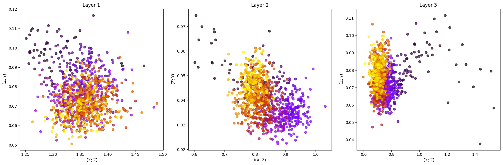
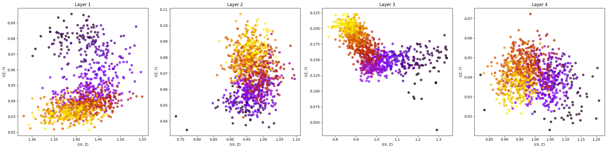
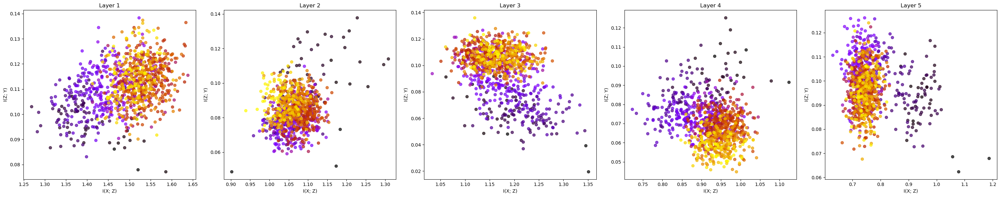
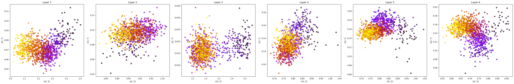
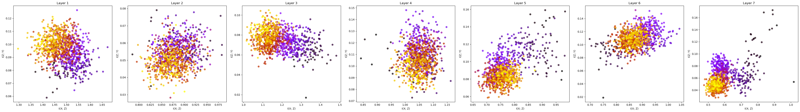
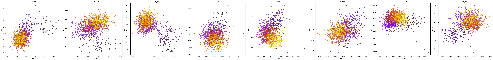
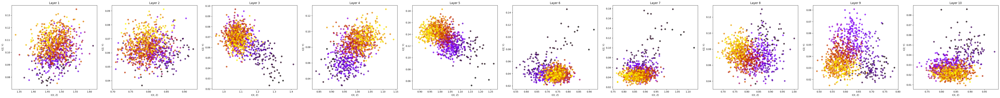
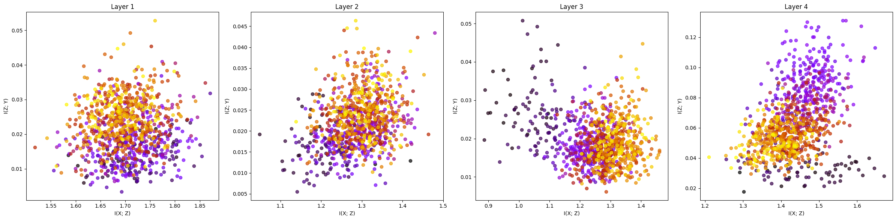
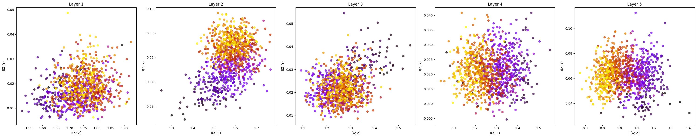
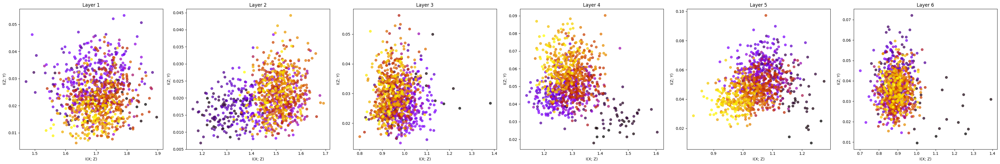

## Datasets

### dataset Statistics 

| Dataset           | Mutagenicity |  |
|-------------------|--------------|--|
| # Graphs          | 4308         |  |
| # Nodes           | 130719       |  |
| # Edges           | 132707       |  |
| # Node labels     | 10           |  |

### Mutagenicity

- Classification as mutagenic/ non-mutagenic (binary classificiation task).

## Models

### GCN 

- From https://doi.org/10.1145/3698108. 

    #### Classifier Accuacy - Batch Size = 128

    | # Layers             | 3         | 4         | 5         | 6         | 7         | 8         | 9         | 10        |
    |----------------------|-----------|-----------|-----------|-----------|-----------|-----------|-----------|-----------|
    | Training             | 0.8843    | 0.8631    | 0.8933    | 0.8675    | 0.8686    | 0.8924    |           | 0.8553    |
    | Validation           | 0.8372    | 0.8047    | 0.8279    | 0.8023    | 0.8209    | 0.8488    |           | 0.8209    |
    | Testing              | 0.7977    | 0.7953    | 0.8070    | 0.7844    | 0.8047    | 0.7953    |           | 0.7884    |

    #### AUC Score - Batch Size = 128
    
    |  # Layers  | 3         | 4         | 5         | 6         | 7         | 8         | 9         | 10        |
    |------------|-----------|-----------|-----------|-----------|-----------|-----------|-----------|-----------|
    | AUC Score  | 0.0000    | 0.0000    | 0.0000    | 0.0000    | 0.0000    | 0.9052    | 0.0000    | 0.8944    |

    #### Classifier Accuacy - Batch Size = 256

    | # Layers             | 3         | 4         | 5         | 6         | 7         | 8         | 9         | 10        |
    |----------------------|-----------|-----------|-----------|-----------|-----------|-----------|-----------|-----------|
    | Training             | 0.0000    | 0.8663    | 0.8846    | 0.8759    | 0.0000    | 0.0000    | 0.0000    | 0.0000    |
    | Validation           | 0.0000    | 0.8070    | 0.8302    | 0.8047    | 0.0000    | 0.0000    | 0.0000    | 0.0000    |
    | Testing              | 0.0000    | 0.8023    | 0.7837    | 0.7814    | 0.0000    | 0.0000    | 0.0000    | 0.0000    |

    #### AUC Score - Batch Size = 256

    |  # Layers  | 3         | 4         | 5         | 6         | 7         | 8         | 9         | 10        |
    |------------|-----------|-----------|-----------|-----------|-----------|-----------|-----------|-----------|
    | AUC Score  | 0.0000    | 0.8980    | 0.9018    | 0.8875    | 0.0000    | 0.0000    | 0.0000    | 0.0000    |

    #### Best Epoch
    | Batch Size | # Layers  | 3         | 4         | 5         | 6         | 7         | 8         | 9         | 10        |
    |------------|-----------|-----------|-----------|-----------|-----------|-----------|-----------|-----------|-----------|
    | 128        |           | 370       | 107       | 173       | 77        | 57        | 93        |           | 34        |
    | 256        |           |           | 155       | 187       | 96        |           |           |           |           |

## Training & MI Calculation 

run_gnn.py --train=1 --num_layers=3 --model=gcn

- Creates ./MI_logs/{args.model}/mi_log_{args.num_layers}_layers.txt file for logging MI values for each I(X;Z), I(Z;Y).
- Mutual Information Estimator from https://doi.org/10.48550/arXiv.1801.09125. 

## Visualizing Information Plane

python3 utils/mi_plots.py --file_name=MI_logs/gcn/run_results_3_layer --model=gcn

- Note that the file_name passed as cmd line arg should not have the '.txt' ending.
- Visualizes information plane plots and saves them to ./plots/{model}/ folder.

### Information Plane Results

#### GCN 3 Layer - Batch Size =  128

#### GCN 4 Layer - Batch Size =  128 

#### GCN 5 Layer - Batch Size =  128 

#### GCN 6 Layer - Batch Size =  128 

#### GCN 7 Layer - Batch Size =  128

#### GCN 8 Layer - Batch Size =  128 

#### GCN 9 Layer - Batch Size =  128 

#### GCN 10 Layer - Batch Size =  128 

#### GCN 4 Layer - Batch Size =  256 

#### GCN 5 Layer - Batch Size =  256 

#### GCN 6 Layer - Batch Size =  256 

